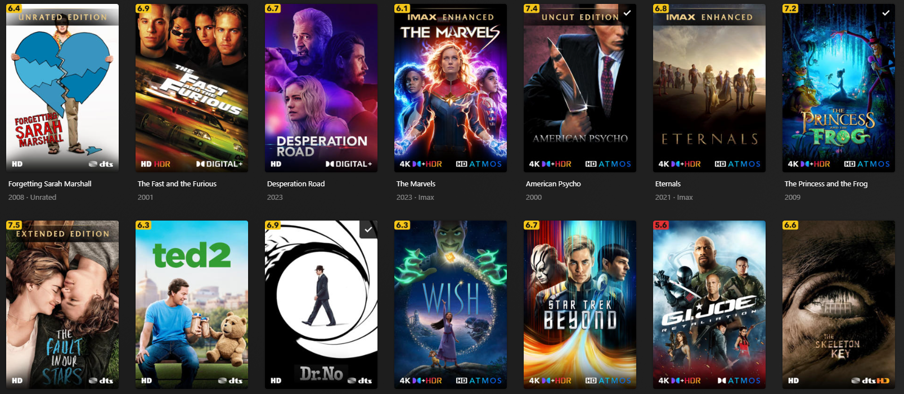
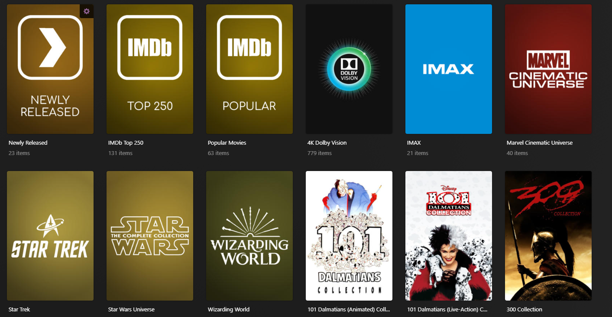
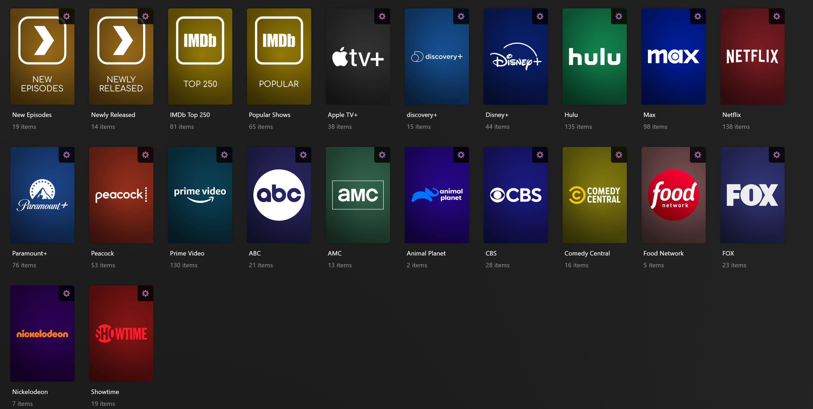

# Kometa Config 
Extract ENTIRE repository directory. Place all contents of either the "Main" or "Minimalist" folder (only choose 1) into your ~~Plex Meta Manager~~ Kometa Config folder. The inside of your Kometa config folder should match what is inside the Main/Minimalist folder. All Folders and Files inside the Main/Minimalist folders are needed for either config to work. (fonts, icons and additiona .yml files, etc) 
If you have not updated your image from Plex Meta Manager to Kometa yet (I recommend you do) you can still use the PMM version of this config [_HERE_](https://github.com/mrbuckwheet/Kometa-Config/releases/tag/PMM-Version) 

## NEW MINIMALIST LOOK 
(based off of jmxd https://github.com/jmxd/Kometa - white overlays are replaced with colored ones and resolution numbers like 1080/720/480 are replaced with HD for a cleaner look. Scores are moved to the top left and all info/codecs are placed on the bottom with proper gradients. Score default is set to "mass_audience_rating_update: mdb_tmdb" and can be changed under the operations section in config.yml) 

\*\*\* ***For the minimalist template to work correctly you MUST use the TRaSH naming convention for your file names*** \*\*\*

https://trash-guides.info/Radarr/Radarr-recommended-naming-scheme/#plex

## Dynamic Collection Builder
The dynamic collection builder in the Movie Collections.yml file will automatically make collections when 2 (this value can be customized) or more Movies from the same collection are in your library. 

\*\*\* ***It is recomment to disable "Minimum automatic collection size" under the advanced library settings. You can also run the "python kometa.py --delete-collections" command if you have previous collections from plex or manually added them before running Kometa to prevent collection duplicates or if you want a clean start*** \*\*\*

   
## 
 MINIMALIST
#### 
 Movie Overlay Preview

#### 
 TV Overlay Preview

#### 
 Movie Collection Preview

#### 
 TV Collection Preview

   
## 
ORIGINAL
#### 
Movie Overlay Preview

#### 
TV Overlay Preview

#### 
Movie Collection Preview

<!-- markdownlint-disable MD033 -->

<!-- markdownlint-enable MD033 -->
